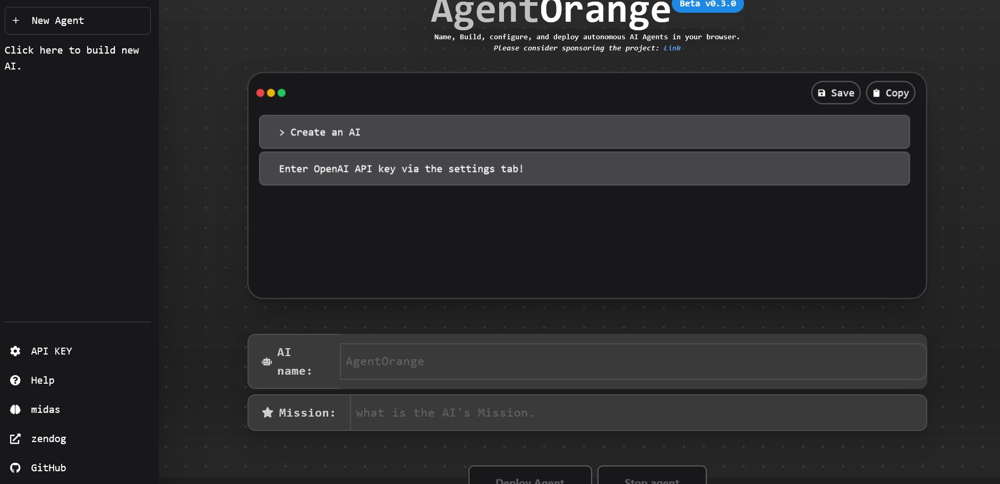

  <em> AGENT ORANGE GPT...Assemble, configure, and deploy autonomous AI Agents in your browser.  </em>
</p>
<p align="center">
    node version 18.0.0
</p>

<p align="center">
If you just need advice on a given topic...<a href="https://zendog-psico-mojo.vercel.app/">Talk to Zendog </a>

</p>
<br>

Agent Orange GPT lies somewhere between Chat gpt and Auto gpt , configure tasks and research projects
for the Agent to work on while you are doing other things.
The AI will configure it's own research methods depending on the specific prompt you provide and return all the results
as it gathers information, once you set it a "mission" it will work on "auto pilot" while you work on other related or unrelated
things...

An example of a "Mission" may be "Research information related to the original BTC wallet belonging to Satoshi Nakamoto."

### 👷 Local Development Setup

If you wish to develop Agent Orange GPT locally, the easiest way is to
use the provided setup script.

```bash
./setup.sh --local
```

### 🛠️ Manual Setup

1. Clone the repository: https://github.com/Mulc1b3R/agent-orange.git

2. Install dependencies:

npm install

3. Create a **.env** file with the following content:

 * The environment variables must match the following [schema](https://github.com/psico-mojo/aibot/blob/main/src/env/schema.mjs).

```
# Deployment Environment:
NODE_ENV=development

# Next Auth config:
# Generate a secret with `openssl rand -base64 32`
NEXTAUTH_SECRET=changeme
NEXTAUTH_URL=http://localhost:3000
DATABASE_URL=file:./db.sqlite
```
# Your open api key

```
OPENAI_API_KEY=YOUR_API_KEY_HERE
```

5. Modify prisma schema to use sqlite:

```
./prisma/useSqlite.sh
```

**Note:** This only needs to be done if you wish to use sqlite.


# Create database migrations
```
npx prisma db push
```
# Run the project:
```
npm run dev
```
******************************************************************************************************************************

******************************************************************************************************************************
Mulc1b3R
```
MADE IN YORKSHIRE
```


